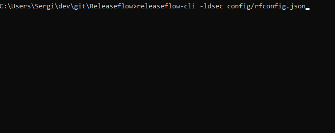

# Releaseflow

> A Node.js command-line application for quickly creating all release files.

## Why will it help me?
After a release build is ready for deployment, there are a _lot_ of tasks to be completed. This program helps organize all those steps, and has various advantages over other deployment applications:
- Automatically:
	- Generates documentation, including information from the project's changelog
	- Builds the executable
	- Packs source code into a ZIP or TAR
- Compatible with Node.js and Maven, and many other project formats coming soon
	- Or, you can define your own XML or JSON file that can be used!
- Installable via [npm](https://www.npmjs.com/package/releaseflow-cli)

## Where do I get it?
The application is installable via [npm](https://www.npmjs.com/package/releaseflow-cli):  
`npm install -g releaseflow-cli`

## Enough talk. Let's see it in action!


## Usage

### Arguments
```
-V, --version        output the version number  
-l, --changelog      build changelog  
-d, --docs           build documentation template  
-e, --exec           build executable  
-c, --config <path>  set config path  
-s, --source         package source code  
-h, --help           output usage information  
```

### rfconfig.json
All the configuration for your project is stored here, formatted as a JSON object. If the file does not exist, Releaseflow will auto-generate a template for you in your project's directory.

#### Properties
```
"package": path to your project's descriptor (i.e. Node.js's `package.json`)  

"markdown": whether to use markdown in documentation or not  

"docs": information used when generating documentation  

	"title": title of the document  
	"dist": output folder path  
	"template": create sections here you would like to appear in the documentation  

"changelog": information used when generating the project's formatted changelog

	"path": input file  
	"header_format": the format of each entry's header (can be multi-line by using '\n') 
	"replace_links": replace issue/pull request identifiers with actual links (i.e. `#1` is replaced by `[#1](https://www.github.com/user/repo/issues/1)`)  
	"dist": output folder path  
	"ignore": array of lines to ignore, such as a sign-off  

"source": information used when compressing the source code  

	"dir": array of glob strings (i.e. `*.txt`, `src/*.*`) of paths to files and folders that should be included  
	"dist": output folder path  
	"compression": array containing compression formats, either `zip` or `tar` (Note: tar's are also gzipped); there will be a file exported for each format specified  

"exec": command used to build the project  
```

#### Interpolaters
There are a set of "interpolaters" that may be used in different parts of the config to include data automatically.

##### Project File
Any property present in the project's descriptor/package file (i.e. `package.json`, `pom.xml`) may be interpolated by using the format of: `%%(property)%`. Examples:  
`%%license%`, `%%artifactId%`, `%%version%`, `%%name%`  

##### Special Identifiers
For the `title` and `template` sections in `docs`, as well as the `dist` properties, project information may be interpolated by using the following identifiers:  
`%%changelog%`: the project's generated, formatted changelog  
`%%toc%`: table of contents  

##### General Regular Expressions
For the `header_format` property _only_, you can supply the following identifiers:  
`%n`: matches an integer  
`%s`: matches a string

For the `dist` properties _only_, you can supply the following identifiers:  
`%e`: default file extension (i.e. 'changelog-1.0.0.%e' would be 'changelog-1.0.0.md' if markdown is enabled)

For example, the `header_format` for `(#23)[4/2/2018-11:12 1.2.0 beta]` would be the following string:  
`(#%n)[%n/%n/%n-%n:%n %%version% %s]`

## How can I help?
View the [Contributing Guidelines](https://github.com/Sergix/JTerm/blob/master/CONTRIBUTING.md) for more information. The Releaseflow project is open to anyone and any code!

## Slack
Request to join the [Sergix](https://sergix.slack.com/) team to recieve notifications on updates, Travis CI build status, and more!

> Releaseflow v1.2.7  
> `1.2.7`  
> This project and its source are held under the GNU General Public License, located in the LICENSE file in the project's directory.  
> (c) 2018